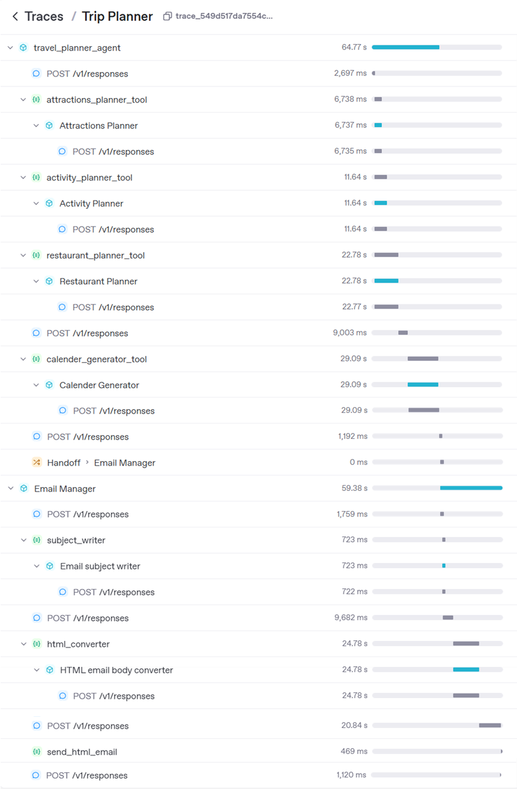
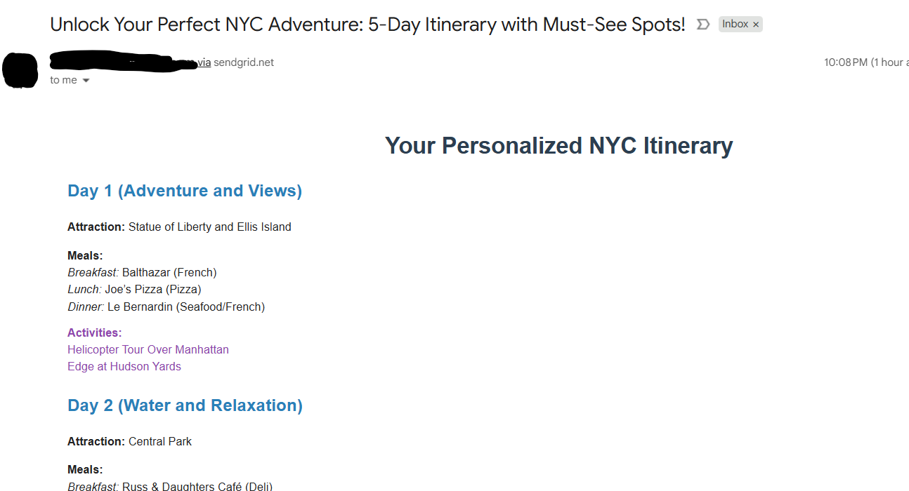

# 🧳 Travel Concierge Specialist

This project implements an agentic AI system for personalized travel planning and itinerary management. It leverages multiple specialized agents and tools to generate travel plans, suggest attractions, activities, and restaurants, and deliver the final itinerary via email with a downloadable calendar file.

---

## ✨ Features

- **Attractions, Activities, and Restaurant Planning:**  
  Specialized agents generate lists of must-see attractions, top activities, and best restaurants for a given destination and duration.

- **Itinerary Generation:**  
  An itinerary agent creates a day-by-day plan, scheduling attractions, activities, and meals.

- **Calendar File Creation:**  
  Generates an `.ics` calendar file with all events, importable into any calendar app.

- **Automated Email Delivery:**  
  Uses SendGrid to send the itinerary and calendar file to the user via email.

- **Agentic Orchestration:**  
  Agents interact via tools and handoffs, using OpenAI models for reasoning and formatting.

---

## 🏗️ How It Works

1. **Agents & Tools:**
    - `Attractions Planner Agent`: Suggests must-see attractions.
    - `Activity Planner Agent`: Suggests top activities.
    - `Restaurant Planner Agent`: Suggests restaurants and meal plans.
    - `Itinerary Planner Agent`: Combines suggestions into a daily plan.
    - `Calendar Generator Agent`: Converts the plan into an `.ics` file.
    - `Email Subject Writer` & `HTML Converter`: Format the email.
    - `Send HTML Email`: Sends the itinerary and calendar file via email.

2. **Workflow:**
    - The user provides a destination and number of days.
    - The `travel_planner_agent` orchestrates the planning using the above agents/tools.
    - The final plan is emailed to the user with a calendar attachment.

---

## 🚀 Getting Started

### 1. Clone the Repository

```bash
git clone https://github.com/harish-anandaramanujam/travel-concierge-specialist.git
cd travel-concierge-specialist
```

### 2. Install Dependencies
Install the `uv` package if you don't have it:

```bash
pip install uv
```
Install required Python packages (see your environment setup for details):

```bash
uv sync
```

### 3. Set Up Environment Variables

Create a `.env` file with your SendGrid API key:

```
SENDGRID_API_KEY=your_sendgrid_api_key
OPENAI_API_KEY=your_open_api_key
```

### 4. Run the Notebook

Open `travel-concierge-planner.ipynb` in JupyterLab or VS Code and run all cells.

---

## 📝 Example Usage

In the notebook, set your message:

```python
message = "New York, 5 days"
with trace("Trip Planner"):
    result = await Runner.run(travel_planner_agent, message)
```

You will receive a detailed itinerary and calendar file by email.

---

## 🖼️ Screenshots & Visuals

Below are some example screenshots of the Travel Concierge Specialist in action:

#### Traces from OpenAI dashboard


##### Email with itenary and respective calender appointments


---


## 📂 Main Components

- [`travel-concierge-planner.ipynb`](travel-concierge-planner.ipynb): Main notebook with all agent and tool definitions.
- `.env`: Store your SendGrid API key here.

---

## 🛠️ Requirements

- Python 3.8+
- SendGrid account and API key
- OpenAI API access (for agent models)
- Jupyter Notebook or compatible IDE

---

## 📌 Notes

- Update sender and recipient emails in the `send_html_email` function as needed.
- The system is modular—add or modify agents and tools for more features.

---

## 📈 Future Improvements

- Integrate hotel and transport planning agents.
- Add user authentication and web interface.
- Support for multi-user and group itineraries.